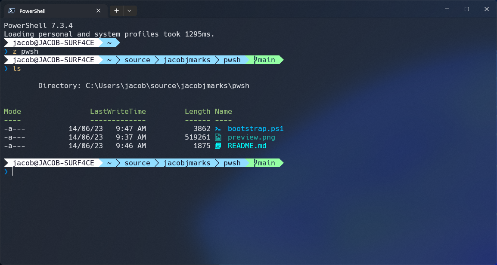

Windows PowerShell Core Bootstrapper



A script to install and configure a Windows PowerShell Core environment powered by [Oh My Posh](https://ohmyposh.dev/), for use in [Windows Terminal](https://learn.microsoft.com/en-au/windows/terminal/).

Designed to be largely non-opinionated, non-clobbering, and repeatable.

Utilises the [Windows Package Manager](https://learn.microsoft.com/en-us/windows/package-manager/) over other third-party options for lightweight and as-native application installation.

## Usage

The script can be invoked remotely with defaults via the following command:

``` pwsh
irm "https://raw.githubusercontent.com/jacobjmarks/pwsh/main/bootstrap.ps1" | iex
```

> If you'd like to stabilise the script against changes, replace `main` with your commit hash of choice.

## Advanced Usage

For advanced usage scenarios and customisation, download the script and utilise the available CLI arguments:

``` pwsh
irm "https://raw.githubusercontent.com/jacobjmarks/pwsh/main/bootstrap.ps1" -OutFile bootstrap.ps1
Get-Help -Detailed .\bootstrap.ps1
```

### Available Parameters

| Parameter   | Type     | Description                                                               | Default     |
| ----------- | -------- | ------------------------------------------------------------------------- | ----------- |
| `-Theme`    | `string` | [Oh My Posh theme](https://ohmyposh.dev/docs/themes) to configure for use | `"paradox"` |
| `-NerdFont` | `string` | [Nerd Font](https://ohmyposh.dev/docs/installation/fonts) to install.     | `"Hack"`    |
| `-NoFonts`  | `switch` | Skip installation of fonts                                                | `$false`    |

## Windows Terminal Configuration

Once the bootstrapping script has been run, the following Windows Terminal configuration is recommended.

At a minimum, you should configure your Terminal to utilise a [Nerd Font](https://ohmyposh.dev/docs/installation/fonts), presumably the one that was installed via the bootstrapping script.

| Setting                                                                                      | Value            |
| -------------------------------------------------------------------------------------------- | ---------------- |
| Startup > Default profile                                                                    | PowerShell       |
| Startup > Default terminal application                                                       | Windows Terminal |
| Appearance > Application Theme                                                               | Dark             |
| Appearance > Use acrylic material in the tab row                                             | `true`           |
| Rendering > Use the new text renderer ("AtlasEngine")                                        | `true`           |
| Profiles: Defaults > Additional settings: Appearance > Text: Color scheme                    | One Half Dark    |
| Profiles: Defaults > Additional settings: Appearance > Text: Font face                       | Hack NF          |
| Profiles: Defaults > Additional settings: Appearance > Transparency: Background opacity      | 75%              |
| Profiles: Defaults > Additional settings: Appearance > Transparency: Enable acrylic material | `true`           |

## Contents

The script installs the latest version of the following components (unless otherwise stated):

### Applications

- [Windows Terminal](https://github.com/microsoft/terminal)
- [PowerShell Core](https://github.com/PowerShell/PowerShell)
- [Git](https://git-scm.com/download/win)

### Modules / Tooling

- [gsudo](https://github.com/gerardog/gsudo)\
  A `sudo` equivalent for Windows.

- [Oh My Posh](https://github.com/jandedobbeleer/oh-my-posh) (via Microsoft Store)\
  _A prompt theme engine for any shell._

- [Terminal-Icons](https://github.com/devblackops/Terminal-Icons)\
  Shows file and folder icons in the terminal.

- [posh-git](https://github.com/dahlbyk/posh-git)\
  Provides Git status information to the prompt.

- [z](https://github.com/badmotorfinger/z)\
  Directory jumper.

### Fonts

- [Hack Nerd Font (v2.3.3)](https://github.com/ryanoasis/nerd-fonts)

## Inspiration

- [How to set up PowerShell prompt with Oh My Posh on Windows 11 by @devaslife | YouTube](https://youtu.be/5-aK2_WwrmM)
- [Tutorial: Set up a custom prompt for PowerShell or WSL with Oh My Posh | Microsoft Learn](https://learn.microsoft.com/en-us/windows/terminal/tutorials/custom-prompt-setup)

# Next Steps

## Optional Components

While not installed via the bootstrapping script, you may find some additional useful components below.

### [7-Zip](https://www.7-zip.org/)

_7-Zip is a file archiver with a high compression ratio._

``` pwsh
winget install -e --id 7zip.7zip
```

### [Azure CLI](https://github.com/Azure/azure-cli)

_The Azure command-line interface (Azure CLI) is a set of commands used to create and manage Azure resources._

``` pwsh
winget install -e --id Microsoft.AzureCLI
```

### [Azure Functions Core Tools](https://github.com/Azure/azure-functions-core-tools)

_The Azure Functions Core Tools provide a local development experience for creating, developing, testing, running, and debugging Azure Functions._

``` pwsh
winget install -e --id Microsoft.AzureFunctionsCoreTools
```

### [NVM for Windows](https://github.com/coreybutler/nvm-windows)

_The Microsoft/npm/Google recommended Node.js version manager for Windows._

``` pwsh
winget install -e --id CoreyButler.NVMforWindows
```
